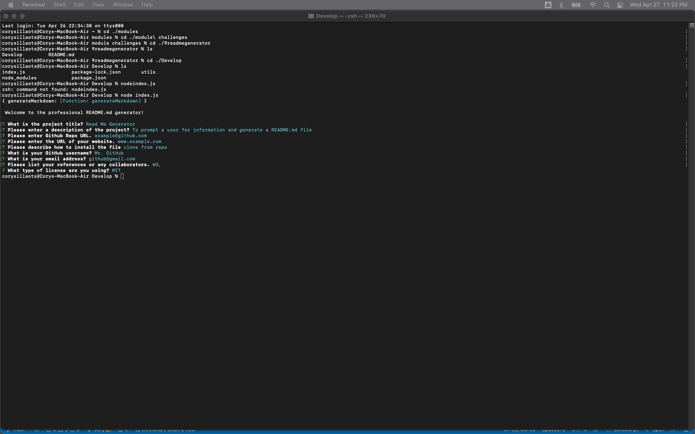
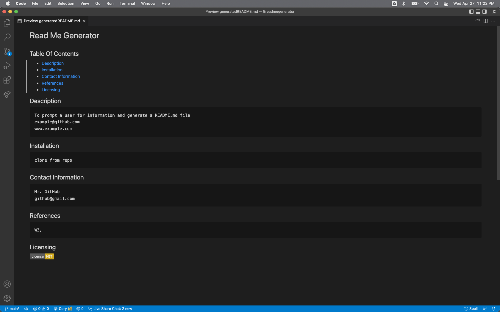

## README generator Generator (Module 9 Challenge)

## Installation:
In order to access the files needed to complete the challenge see: https://github.com/CorySillaots/Read-Me-Generator and clone either the following HTTPS link or SSH key:
HTTPS Link: https://github.com/CorySillaots/Read-Me-Generator.git
SSH Key: git@github.com:CorySillaots/Read-Me-Generator.git
In order to clone the project to a "projects" directory, open your terminal (mac) or gitbash (windows) window and type the following commands into your terminal/gitbash command line:
1 - mkdir projects
2 - cd ./projects (You can use the command "pwd" to ensure you are in the correct directory)
3 - git clone <HTTPS link> OR git clone <SSH Key>
4 - ls (this will list all of the files now inside of the current directory)

Open your coding software, select "open file" and locate the module-3-challenge file in your projects directory OR find the correct file in your directory and "Open With" your coding software.

## Usage
- The purpose of the Read Me Generator is to prompt a user for information and automatically generate a README.md file with the information
- The generated README.md needs to include a standard table of contents
- The generated README.md needs to include a description of the project
- The generated README.md needs to include the user's contact information
- The generated README.md needs to include references and collaborators
- The generated README.md needs to include proper licensing and licensing badges

## Collaborators and References
- Portfolio generator Project Code
    University Of Toronto SCS Coding Boot Camp

- Module 9 in-class exercises
    University of Toronto SCS Coding Boot Camp

- W3 Schools
    www.w3schools.com

- Stack Overflow
    https://stackoverflow.com

- Codecademy
    www.codecademy.com

- Veronica To
    https://github.com/TOVTC

## License
Copyright 2022, Cory Sillaots

Permission is hereby granted, free of charge, to any person obtaining a copy of this software and associated documentation files (the "Software"), to deal in the Software without restriction, including without limitation the rights to use, copy, modify, merge, publish, distribute, sublicense, and/or sell copies of the Software, and to permit persons to whom the Software is furnished to do so, subject to the following conditions:

The above copyright notice and this permission notice shall be included in all copies or substantial portions of the Software.

THE SOFTWARE IS PROVIDED "AS IS", WITHOUT WARRANTY OF ANY KIND, EXPRESS OR IMPLIED, INCLUDING BUT NOT LIMITED TO THE WARRANTIES OF MERCHANTABILITY, FITNESS FOR A PARTICULAR PURPOSE AND NONINFRINGEMENT. IN NO EVENT SHALL THE AUTHORS OR COPYRIGHT HOLDERS BE LIABLE FOR ANY CLAIM, DAMAGES OR OTHER LIABILITY, WHETHER IN AN ACTION OF CONTRACT, TORT OR OTHERWISE, ARISING FROM, OUT OF OR IN CONNECTION WITH THE SOFTWARE OR THE USE OR OTHER DEALINGS IN THE SOFTWARE.

